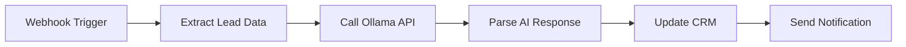
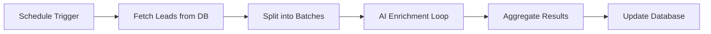

# Ollama + Phi-3 Integration Guide for n8n

## 🤖 Overview
This guide covers integrating Ollama with Microsoft's Phi-3 model into your n8n workflows for cost-effective, local AI inference. No cloud API costs, complete privacy, and fast response times.

## 🎯 Why Ollama + Phi-3?

### Cost Benefits
- **Zero API costs** - Run locally without per-token charges
- **No rate limits** - Process unlimited requests
- **Privacy first** - Data never leaves your machine
- **Offline capable** - Works without internet connection

### Phi-3 Advantages
- **Small footprint** - Only 2.3GB model size
- **High performance** - Competitive with larger models
- **Fast inference** - Optimized for local deployment
- **Commercial friendly** - MIT license for business use

## 🔧 Installation & Setup

### Step 1: Install Ollama
```powershell
# Method 1: Download from official website
# Visit: https://ollama.ai/download

# Method 2: Using winget (if available)
winget install Ollama.Ollama

# Method 3: Using Chocolatey
choco install ollama

# Verify installation
ollama --version
```

### Step 2: Verify Ollama Service
```powershell
# Check if Ollama is already running (common on Windows)
curl http://localhost:11434/api/version

# If you get "bind: Only one usage" error, Ollama is already running!
# This is normal - Ollama runs as a background service on Windows

# Find Ollama installation path if needed:
Get-Process ollama | Select-Object Path
```

### Step 3: Download Phi-3 Model
```.;

# If 'ollama' command is not in PATH, use full path:
& "C:\Users\CUSTOM PC\AppData\Local\Programs\Ollama\ollama.exe" pull phi3:mini

# Or add Ollama to PATH and then use:
# ollama pull phi3:mini

# Verify model download via API
curl http://localhost:11434/api/tags

# Test model locally with API call
$testPrompt = @{
    model = "phi3:mini"
    prompt = "Hello, introduce yourself briefly."
    stream = $false
} | ConvertTo-Json

Invoke-RestMethod -Uri "http://localhost:11434/api/generate" -Method POST -Body $testPrompt -ContentType "application/json"
```

## 🔗 n8n Integration Patterns

### Pattern 1: HTTP Request Node Setup
Configure HTTP Request node in n8n:

**Basic Configuration:**
- **Method**: POST
- **URL**: `http://host.docker.internal:11434/api/generate`
- **Headers**:
  ```json
  {
    "Content-Type": "application/json"
  }
  ```

**Request Body:**
```json
{
  "model": "phi3:mini",
  "prompt": "{{ $json.user_input }}",
  "stream": false,
  "options": {
    "temperature": 0.7,
    "top_p": 0.9,
    "max_tokens": 500
  }
}
```

### Pattern 2: Chat Completion Format
For conversational AI workflows:

```json
{
  "model": "phi3:mini",
  "messages": [
    {
      "role": "system",
      "content": "You are a helpful AI assistant for lead enrichment."
    },
    {
      "role": "user",
      "content": "{{ $json.user_message }}"
    }
  ],
  "stream": false,
  "options": {
    "temperature": 0.3,
    "max_tokens": 300
  }
}
```

### Pattern 3: Streaming Responses
For real-time AI responses:

```json
{
  "model": "phi3:mini",
  "prompt": "{{ $json.prompt }}",
  "stream": true
}
```

## 🛠️ Lead Enrichment Use Cases

### Use Case 1: Company Description Generation
```json
{
  "model": "phi3:mini",
  "prompt": "Based on the company name '{{ $json.company_name }}' and website '{{ $json.website }}', write a professional 2-sentence company description focusing on their main business and value proposition.",
  "stream": false,
  "options": {
    "temperature": 0.3,
    "max_tokens": 100
  }
}
```

### Use Case 2: Email Personalization
```json
{
  "model": "phi3:mini",
  "prompt": "Write a personalized cold email opening line for {{ $json.prospect_name }} who works as {{ $json.job_title }} at {{ $json.company_name }} in the {{ $json.industry }} industry. Keep it professional and under 25 words.",
  "stream": false,
  "options": {
    "temperature": 0.5,
    "max_tokens": 50
  }
}
```

### Use Case 3: Lead Scoring Analysis
```json
{
  "model": "phi3:mini",
  "prompt": "Analyze this lead profile and provide a score from 1-10 with brief reasoning:\nCompany: {{ $json.company_name }}\nIndustry: {{ $json.industry }}\nSize: {{ $json.employee_count }} employees\nRevenue: {{ $json.annual_revenue }}\nLocation: {{ $json.location }}\nJob Title: {{ $json.contact_title }}",
  "stream": false,
  "options": {
    "temperature": 0.2,
    "max_tokens": 150
  }
}
```

## 📊 n8n Workflow Examples

### Workflow 1: Automated Lead Enrichment Pipeline



**Node Configuration:**
1. **Webhook**: Receive lead data
2. **Set Node**: Format data for AI
3. **HTTP Request**: Call Ollama with prompt
4. **Code Node**: Parse and clean response
5. **HTTP Request**: Update CRM with enriched data
6. **Email**: Send completion notification

### Workflow 2: Batch Lead Processing



## ⚙️ Performance Optimization

### Model Parameters Tuning
```json
{
  "options": {
    "temperature": 0.3,      // Lower = more consistent, higher = more creative
    "top_p": 0.9,           // Nucleus sampling parameter
    "top_k": 40,            // Limit to top K tokens
    "repeat_penalty": 1.1,   // Prevent repetition
    "max_tokens": 300,       // Response length limit
    "stop": ["\n\n", "END"] // Stop sequences
  }
}
```

### Concurrent Request Handling
```powershell
# Configure Ollama for multiple concurrent requests
$env:OLLAMA_NUM_PARALLEL = "4"
$env:OLLAMA_MAX_LOADED_MODELS = "2"

# Restart Ollama service
ollama serve
```

### Memory Management
```powershell
# Monitor Ollama resource usage
Get-Process ollama

# Check GPU utilization (if using GPU)
ollama ps
```

## 🔍 Error Handling & Monitoring

### Common HTTP Status Codes
- **200**: Success
- **400**: Bad request (invalid JSON/parameters)
- **404**: Model not found
- **500**: Server error

### Error Handling in n8n
Use the **If Node** to handle errors:

```json
// Check if response is successful
{
  "conditions": {
    "number": [
      {
        "value1": "{{ $json.status_code }}",
        "operation": "equal",
        "value2": 200
      }
    ]
  }
}
```

### Monitoring Script
```powershell
# Check Ollama service health
function Test-OllamaHealth {
    try {
        $response = Invoke-RestMethod -Uri "http://localhost:11434/api/version" -Method GET
        Write-Host "✅ Ollama is running - Version: $($response.version)"
        return $true
    }
    catch {
        Write-Host "❌ Ollama is not responding: $($_.Exception.Message)"
        return $false
    }
}

# Test model availability
function Test-OllamaModel {
    param($ModelName)
    try {
        $models = Invoke-RestMethod -Uri "http://localhost:11434/api/tags" -Method GET
        $available = $models.models | Where-Object { $_.name -eq $ModelName }
        if ($available) {
            Write-Host "✅ Model $ModelName is available"
            return $true
        } else {
            Write-Host "❌ Model $ModelName not found"
            return $false
        }
    }
    catch {
        Write-Host "❌ Error checking models: $($_.Exception.Message)"
        return $false
    }
}

# Run health checks
Test-OllamaHealth
Test-OllamaModel "phi3:mini"
```

## 🚀 Advanced Configuration

### Custom Model Fine-tuning
```powershell
# Create custom Modelfile
@"
FROM phi3:mini

PARAMETER temperature 0.3
PARAMETER top_p 0.9
PARAMETER stop "<|im_end|>"

SYSTEM "You are a professional lead enrichment AI assistant. Always provide accurate, concise, and business-focused responses."
"@ | Out-File -FilePath "Modelfile" -Encoding utf8

# Create custom model
ollama create lead-enricher -f Modelfile
```

### Docker Integration
If running n8n in Docker, ensure Ollama is accessible:

```yaml
# Add to docker-compose.yml if running Ollama in container
ollama:
  image: ollama/ollama:latest
  ports:
    - "11434:11434"
  volumes:
    - ollama_data:/root/.ollama
  environment:
    - OLLAMA_NUM_PARALLEL=4

volumes:
  ollama_data:
```

### API Rate Limiting
```json
// Implement delays between requests
{
  "model": "phi3:mini",
  "prompt": "{{ $json.prompt }}",
  "stream": false,
  "keep_alive": "5m"  // Keep model in memory
}
```

## 📈 Performance Benchmarks

### Response Times (Phi-3 Mini)
- **Simple prompt (50 tokens)**: ~500ms
- **Complex prompt (200 tokens)**: ~2-3 seconds
- **Batch processing (10 requests)**: ~15-20 seconds

### Resource Usage
- **RAM**: 4-6GB when model is loaded
- **CPU**: Moderate usage during inference
- **GPU**: Optional, significantly faster with GPU

## 🔐 Security Considerations

### Local Network Only
```powershell
# Bind Ollama to localhost only (default)
$env:OLLAMA_HOST = "127.0.0.1:11434"
ollama serve
```

### Firewall Configuration
```powershell
# Allow n8n to access Ollama (if needed)
New-NetFirewallRule -DisplayName "Ollama Local Access" -Direction Inbound -Protocol TCP -LocalPort 11434 -Action Allow -Profile Private
```

## 🧪 Testing & Validation

### Test Script
```powershell
# Test Ollama + Phi-3 integration
function Test-OllamaIntegration {
    $testPrompt = @{
        model = "phi3:mini"
        prompt = "Generate a professional company description for a tech startup called 'DataFlow Solutions' that specializes in data analytics."
        stream = $false
        options = @{
            temperature = 0.3
            max_tokens = 100
        }
    } | ConvertTo-Json -Depth 3

    try {
        $response = Invoke-RestMethod -Uri "http://localhost:11434/api/generate" -Method POST -Body $testPrompt -ContentType "application/json"
        Write-Host "✅ Test successful!"
        Write-Host "Response: $($response.response)"
        return $true
    }
    catch {
        Write-Host "❌ Test failed: $($_.Exception.Message)"
        return $false
    }
}

Test-OllamaIntegration
```

## 🎯 Best Practices

### Prompt Engineering
1. **Be specific** - Clear, detailed prompts get better results
2. **Set context** - Include relevant background information
3. **Define format** - Specify desired output structure
4. **Use examples** - Show the AI what you want
5. **Set constraints** - Limit response length and scope

### n8n Integration
1. **Error handling** - Always check response status
2. **Rate limiting** - Don't overwhelm the API
3. **Caching** - Store results to avoid redundant calls
4. **Monitoring** - Track usage and performance
5. **Fallbacks** - Have backup plans for failures

---
*This integration provides enterprise-grade AI capabilities without the ongoing costs of cloud APIs.*
